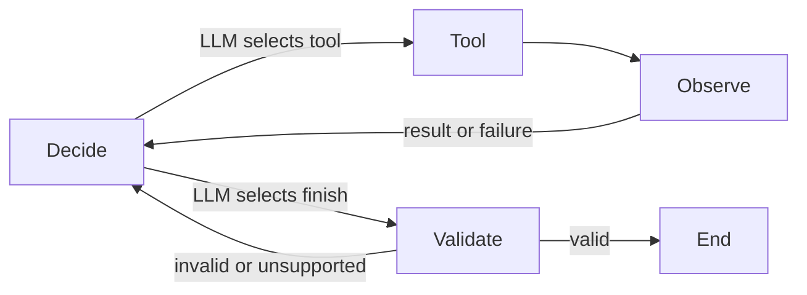

# Task 3 — Agentic Financial Research

## Objective and architecture

Answer the assessment's current financial-health/market-sentiment question with three evidence-supported share-price risks over 90 days and one data-driven hedge concept. Task 2 remains unimplemented.

| Module | Responsibility |
| --- | --- |
| `schemas.py` / `state.py` | Pydantic decisions, evidence-linked metrics, reports and handoffs; TypedDict graph state |
| `tools.py` | Five callable implementations, shared Task 1 services, argument validation and enforced role permissions |
| `runtime.py` | Shared bounded LangGraph decision/tool/observation loop and evidence validation |
| `single_agent.py` | Single researcher with persistent cache guard |
| `multi_agent.py` | Mandatory analyst/review/clarification/writer graph |
| `prompts.py` | Separate agent, tool-description and follow-up instructions |
| `memory.py` | State-only follow-ups and versioned atomic ticker/date JSON persistence |
| `tracing.py` | Redacted full session events and truncated tool JSONL logging |
| `task3_agentic.ipynb` | Executable Colab demonstrations, initially without outputs |

The application uses LangGraph `StateGraph` directly. Groq returns a validated action containing a concise decision rationale and either a tool name/arguments or a structured finish output. The existing Task 1 CompletionClient, JSON/fenced-JSON parser, Groq environment configuration and SDK are reused; a second provider client is unnecessary.



## Autonomous selection and observe/replan

No tool order is encoded in graph edges. Each decision sees allowed tool schemas, successful/failed observations, available verified headlines, structured handoffs, evidence IDs and remaining budget. Failed tool name/arguments are normalized (defaults, ticker case and JSON ordering) in state; identical failed calls are blocked before dispatch. Changed arguments or another source remain allowed. Invalid JSON/actions/final outputs replan instead of fabricating results. Each stage has a default budget of 12 planning responses (configurable 1–30). Groq retries transient errors internally with bounded 1/2/4-second backoff and Retry-After; deterministic provider errors stop immediately. Exhausted transport stops with a safe category without consuming planning steps. Injected legacy clients have a separate two-failure bound with a pause. SDK retries remain disabled to prevent nested retries. Budget exhaustion returns `report=None` with an explicit error.

Reports require successful price/volatility evidence AND news/search evidence, as well as a quantitative hedge reference. The writer's validated analyst handoff supplies quantitative coverage. Sentiment alone does not replace a news/search observation. Coverage status is supplied to the planner. These are evidence-coverage checks, not a fixed sequence. The three risks must cite known successful observations or permitted handoff IDs. Numeric handoff fields must exactly match retrieved values and canonical paths. Structural/reference checks cannot verify all qualitative LLM claims.

## Five tools and reuse

All agent/notebook invocations go through `ToolExecutor.invoke(role, tool_name, arguments)`. It returns a typed ToolObservation envelope with evidence_id, output, success/error and cache_hit. FinancialTools provides the callable implementations; the dispatcher is the permission/logging boundary.

| Tool | Structured output |
| --- | --- |
| `get_price_data(ticker, period)` | OHLCV/indicators, dated rows, latest values, adjusted-price basis and summary through Task 1 run_pipeline. Period: 2y/5y/10y/max. News is explicitly excluded. |
| `get_news(ticker, n)` | Task 1 title/publisher/published_at/url records. Yahoo primary, recent no-key Google News RSS fallback for shortfalls, deduplicated across sources. Requests at least ten upstream; returns up to n (1–50). Source selection is logged. |
| `calculate_volatility(ticker, window)` | Annualized historical volatility as a fraction, observation count, date and formula; session Task 1 history is reused. |
| `llm_sentiment(headlines)` | Task 1 validated per-headline results and deterministic aggregate, including failures. Only caller-supplied or actually retrieved headline titles are accepted. |
| `web_search(query)` | Up to five title/url/snippet results from free DDGS with backend=duckduckgo; no search API key. |

Volatility uses simple returns `r[t] = Close[t]/Close[t-1]-1`, without filling gaps. For the latest window consecutive valid returns (2–252):

`annualized_volatility = sample_std(returns, ddof=1) * sqrt(252)`.

One additional close is required. 252 is the explicit trading-days-per-year convention. Adjusted Close follows Task 1. A fraction of 0.20 means 20%; this is historical volatility, not a 90-day forecast or loss probability. No options chain is retrieved, so strikes, premiums, deltas and liquidity must not be invented.

## Agent roles and mandatory critique

| Role | Only permitted tools |
| --- | --- |
| Single researcher | All five |
| Agent A — Data Analyst | get_price_data, calculate_volatility, llm_sentiment |
| Agent B — Research Writer | get_news, web_search |

Permissions are enforced before tool lookup or cache access, not only in prompts. B can consume A's quantitative handoff but cannot invoke price/volatility tools. Task 1's backward-compatible include_news=False option avoids hidden news fetching through A's price tool. Sentiment can use seed headlines or headlines retrieved by B and retained as structured records in the trusted registry; A cannot fabricate or directly fetch news.

Every uncached multi-agent run executes:

1. A autonomously gathers allowed evidence and produces a Pydantic QuantitativeBrief.
2. B receives validated structured fields, reviews the brief and can gather news/search.
3. B produces one ClarificationRequest: a specific question, one requested metric and a reason.
4. A receives the typed request plus previous state, selects allowed tools or existing evidence, and returns a ClarificationResponse for the exact question/metric. Unavailable data is acknowledged.
5. B receives both handoffs and produces ResearchReport. Its clarification_used must equal A's answer; available quantitative clarification must be cited in the final analysis. Ignoring it causes rejection/replanning.

The stage order is fixed because the critique is mandatory. Tool order inside each stage remains autonomous. No manual interruption is needed after the initial query. Structured_handoff, critique_request and clarification_response events expose execution, and positive/negative tests verify actual incorporation.

## Short-term and persistent memory

Live state retains observations, reports and typed handoffs. `answer_followup(run, question, client)` has no reachable tool executor: it asks the LLM to answer from memory only and validates references. It may make an LLM call but cannot refetch Yahoo/volatility/search. The notebook asserts unchanged tool counters and JSONL byte size.

Full price history remains in session state, but model context contains only five recent rows plus row count, summary and latest indicators. Persisted observations use that compact view. Questions outside supplied memory must be treated as unavailable.

Completed runs are atomically saved to `task3_agentic/memory/TICKER_UTC-DATE.json`, with a version and separate single/multi slots. A cached single report cannot bypass the two-agent critique. Schema-invalid, corrupt or incompatible caches are misses; incomplete runs are not saved. Same ticker/date/workflow cache loads occur before any tool/LLM call and emit a persistent_cache_hit event. Old trace events are saved history, not re-executed calls.

The date partitions execution cache, not historical as-of price retrieval. It defaults to UTC today; provider observations retain their dates. Query/model/prompt are not separate cache-key dimensions: this cache is intended for the canonical assessment question. Use follow-ups for additional questions or use_cache=False to rerun; this also clears provider/tool session snapshots. A new UTC cache date clears snapshots automatically. Local JSON is not a concurrent multi-process database or tamper-proof evidence archive.

## Observability and security

Every dispatcher invocation, including failures, denied calls and session cache hits, appends to `task3_agentic/logs/agent_trace.jsonl`. Fields include UTC timestamp, role, tool_name, input_arguments, output, duration_ms, success and cache_hit. Output is truncated after redaction to at most 200 characters; the snippet need not be complete JSON.

ResearchRun.trace retains full sanitized model-facing messages, decisions, observations/replans and handoffs. The notebook displays both an event table and expanded JSON. Price observations use the same compact view sent to the model. Decision explanations are recorded, not private internal model reasoning. Tool-log storage failure stops unobservable execution explicitly; ordinary provider failures replan.

Redaction removes secret-named fields, configured secret values, bearer credentials and common token patterns from traces/context/cache. Raw provider exception bodies are not retained by Task 3. API keys use existing SDK environment configuration. `.env`, temporary logs and memory are ignored; the required `logs/agent_trace.jsonl` is intentionally committed. TLS verification stays enabled. Never put arbitrary credentials in questions or source text: unrecognized opaque secrets cannot be guaranteed identifiable.

## Running and verification

Install root requirements using Python 3.11+. Configure GROQ_API_KEY/GROQ_MODEL securely and open task3_agentic.ipynb locally or in Colab. The notebook uses GroqClient(max_completion_tokens=1800); Task 1's default remains 700.

```python
from task1_financial.llm import GroqClient
from task3_agentic.tools import FinancialTools, ToolExecutor
from task3_agentic.runtime import AgentRuntime
from task3_agentic.multi_agent import TwoAgentResearch
from task3_agentic.memory import answer_followup

client = GroqClient(max_completion_tokens=1800)
runtime = AgentRuntime(client, ToolExecutor(FinancialTools("NVDA", client)))
run = TwoAgentResearch(runtime).run()
if run.report is not None:
    final_report = run.report.model_dump(mode="json")
    followup = answer_followup(run, "What evidence supports the hedge?", client)
```

Run `python -m pytest -q` from the root. Tests mock Groq/Yahoo/search while executing the real LangGraph nodes and critique path. They verify role denials, failure recovery, numerical grounding, mandatory clarification incorporation, session reuse, refresh and persistent caches. Live checks are separate from the suite.

Validation on 2026-10-07: 105 tests passed, preserving all original 73. Import/compile, Python 3.11 syntax, notebook schema/cell syntax, lint/format and whitespace checks passed. Live search returned five results and its JSONL record was inspected; Yahoo failed TLS verification, and Groq/agent live smoke was skipped due to unavailable key/model settings. Autonomous/critique/memory behavior was exercised with mocks, not claimed as a live LLM result.

Reliability validation (2026-10-07): 128 offline tests passed, including all original 105. The live no-key RSS smoke returned ten recent real NVDA headlines with normal TLS verification. Groq credentials were unavailable locally, so a successful live single/two-agent report remains to be verified in Colab.

In Colab, use the updated checkout and restart the runtime to avoid stale imports. Load Groq settings through userdata/hidden prompts and run all cells. Inspect the real decision → tool → observation → replan → next-action cycle, A's brief, B's critique and A's response. Then inspect the follow-up/cache assertions and JSONL contents. Saved outputs must come from actual execution; do not claim live agent performance from mocked tests alone. If the safe category is rate_limit, wait for quota reset; invalid_request requires checking model/configuration/input rather than repeated immediate attempts.

## Limitations

Yahoo TLS/rate limits, search availability and missing Groq settings can prevent research. JSON object mode is model-dependent and decision budgets can be exhausted. Search snippets are not independently verified documents and may be stale, biased or incomplete. Prompt injection cannot be eliminated by instructions/role restrictions alone. OHLCV/PE/headlines cannot establish comprehensive balance-sheet health; filings/fundamentals need independent review. Historical volatility depends on the window/stationarity assumptions, and confidence/sentiment/hedge language are not calibrated trading signals. Numerical/reference grounding does not validate causal risk statements. Same-day caches can be stale. Review actual sources, traces, hedge feasibility and notebook outputs before submission.

References: [LangGraph StateGraph](https://reference.langchain.com/python/langgraph/graph/state/StateGraph), [DDGS API](https://pypi.org/project/ddgs/) and the existing [Groq citations](../CITATIONS.md).
