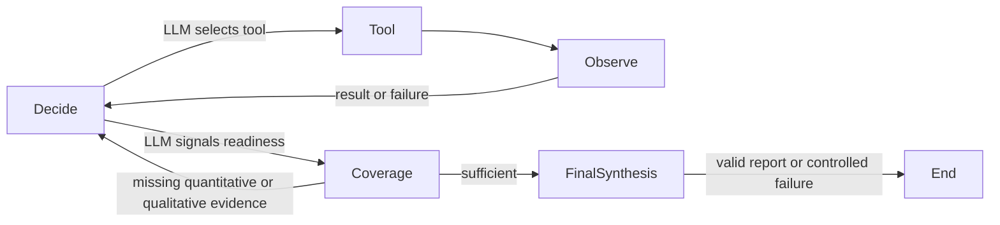

# Task 3 — Agentic Financial Research

## Objective and architecture

Answer the assessment's current financial-health/market-sentiment question with three evidence-supported share-price risks over 90 days and one data-driven hedge concept. Task 2 remains unimplemented.

| Module | Responsibility |
| --- | --- |
| `schemas.py` / `state.py` | Pydantic decisions, evidence-linked metrics, reports and handoffs; TypedDict graph state |
| `tools.py` | Five callable implementations, shared Task 1 services, argument validation and enforced role permissions |
| `sentiment.py` | One Task 3 sentiment batch request, independent item validation and reused aggregate formula |
| `runtime.py` | Shared bounded LangGraph decision/tool/observation loop and evidence validation |
| `synthesis.py` | Final synthesis and writer-finish validation with a compact digest, local validation and one targeted repair |
| `demonstrations.py` | Opt-in, one-failure executor for the labelled notebook replan demonstration |
| `demo_client.py` | Task 3-only request budgets, provider JSON fallback and optional section/request pacing |
| `single_agent.py` | Single researcher with persistent cache guard |
| `multi_agent.py` | Mandatory analyst/review/clarification/writer graph |
| `prompts.py` | Separate agent, tool-description and follow-up instructions |
| `memory.py` | State-only follow-ups and versioned atomic ticker/date JSON persistence |
| `tracing.py` | Redacted full session events and truncated tool JSONL logging |
| `task3_agentic.ipynb` | Executable Colab demonstrations; saved outputs preserved |

The application uses LangGraph `StateGraph` directly. The single research planner returns a Pydantic ResearchDecision with a concise rationale and either tool arguments or a readiness signal; it never writes a report. A separate final_synthesis node produces and validates ResearchReport. The multi-agent stages retain their existing AgentAction and typed stage-output contracts. The existing frozen Task 1 CompletionClient, safe JSON/fenced-JSON parser and Groq configuration/SDK are reused.



## Autonomous selection and observe/replan

No tool order is encoded in graph edges. Each decision sees allowed tool schemas, successful/failed observations, available verified headlines, structured handoffs, evidence IDs and remaining budget. Failed tool name/arguments are normalized (defaults, ticker case and JSON ordering) in state; identical failed calls are blocked before dispatch. Changed arguments or another source remain allowed. Invalid planning actions or premature readiness replan; the multi-agent stage contracts retain bounded output correction. Each stage has a default budget of 12 planning responses (configurable 1–30). Groq retries transient errors internally with bounded 1/2/4-second backoff and Retry-After, independent of planning steps. Injected legacy clients have a separate two-failure bound with a pause. SDK retries remain disabled to prevent nested retries. Budget exhaustion returns `report=None` with an explicit error.

For the single researcher, readiness passes the coverage guard to a separate LangGraph `final_synthesis` node. It receives summary/latest indicators, compact news/search/sentiment evidence and preserved IDs; the full report schema is sent here, not in each planner request. One LLM-generated report is parsed safely and validated with Pydantic plus the existing evidence/language checks. Parse/schema/grounding failures get at most ONE targeted repair using the same evidence. This node cannot dispatch tools or return to planning. Groq JSON-object mode stays first; only a provider `json_validate_failed` rejection permits the repair in text mode requesting JSON, with the same mandatory local validation. Other exhausted transport errors stop. No fallback report is fabricated.

Reports require successful price/volatility evidence AND news/search evidence, as well as a quantitative hedge reference. The writer's validated analyst handoff supplies quantitative coverage. Sentiment alone does not replace a news/search observation. Coverage status is supplied to the planner. These are evidence-coverage checks, not a fixed sequence. The three risks must cite known successful observations or permitted handoff IDs. Numeric handoff fields must exactly match retrieved values and canonical paths. Structural/reference checks cannot verify all qualitative LLM claims.

## Five tools and reuse

All agent/notebook invocations go through `ToolExecutor.invoke(role, tool_name, arguments)`. It returns a typed ToolObservation envelope with evidence_id, output, success/error and cache_hit. FinancialTools provides the callable implementations; the dispatcher is the permission/logging boundary.

| Tool | Structured output |
| --- | --- |
| `get_price_data(ticker, period)` | OHLCV/indicators, dated rows, latest values, adjusted-price basis and summary through Task 1 run_pipeline. Period: 2y/5y/10y/max. News is explicitly excluded. |
| `get_news(ticker, n)` | Task 1 title/publisher/published_at/url records. Yahoo primary, recent no-key Google News RSS fallback for shortfalls, deduplicated across sources. Requests at least ten upstream; returns up to n (1–50). Source selection is logged. |
| `calculate_volatility(ticker, window)` | Annualized historical volatility as a fraction, observation count, date and formula; session Task 1 history is reused. |
| `llm_sentiment(headlines)` | ONE Task 3 batch request for up to 10 trusted headlines; individually validated results and the unchanged deterministic Task 1 aggregate, including failures. |
| `web_search(query)` | Up to five title/url/snippet results from free DDGS with backend=duckduckgo; no search API key. |

Volatility uses simple returns `r[t] = Close[t]/Close[t-1]-1`, without filling gaps. For the latest window consecutive valid returns (2–252):

`annualized_volatility = sample_std(returns, ddof=1) * sqrt(252)`.

One additional close is required. 252 is the explicit trading-days-per-year convention. Adjusted Close follows Task 1. A fraction of 0.20 means 20%; this is historical volatility, not a 90-day forecast or loss probability. No options chain is retrieved, so strikes, premiums, deltas and liquidity must not be invented.

## Agent roles and mandatory critique

| Role | Only permitted tools |
| --- | --- |
| Single researcher | All five |
| Agent A — Data Analyst | get_price_data, calculate_volatility, llm_sentiment |
| Agent B — Research Writer | get_news, web_search |

Permissions are enforced before tool lookup or cache access, not only in prompts. B can consume A's quantitative handoff but cannot invoke price/volatility tools. Task 1's backward-compatible include_news=False option avoids hidden news fetching through A's price tool. Sentiment can use seed headlines or headlines retrieved by B and retained as structured records in the trusted registry; A cannot fabricate or directly fetch news.

Every uncached multi-agent run executes:

1. A autonomously gathers allowed evidence and produces a Pydantic QuantitativeBrief.
2. B receives the Pydantic QuantitativeBrief (the DataBrief), reviews it and gathers news/search.
3. B produces one ClarificationRequest: a specific question, one missing requested metric and a material reason. Code rejects a request for an already supplied non-null brief metric or one made before qualitative research. The prompt encourages sentiment analysis of B's actual retrieved headlines when useful and missing; it does not fix the metric or question wording. Only A has llm_sentiment, so this is a complementary handoff rather than redundant data access.
4. A receives the typed request plus previous state, selects allowed tools or existing evidence, and returns a ClarificationResponse for the exact question/metric. A sentiment_score request must actually invoke llm_sentiment on B's retrieved headlines; an available validated score cannot be replaced with null. The Task 3 client permits ONE text-mode JSON fallback per JSON-generating request rejected with HTTP 400/json_validate_failed, followed by the existing safe parsing, Pydantic validation and exact metric grounding. This applies to all stages, is separate from transport backoff/local schema repair, and does not consume a planning step. Exhaustion returns no clarification. Unavailable data is acknowledged.
5. B receives both handoffs plus compact deterministic volatility/sentiment coverage facts and validates against WriterResearchReport: clarification_used is a required non-null/non-empty string copied verbatim from A's answer. Available quantitative clarification must also be cited in the final analysis. Citations alone cannot replace the required field. A field-specific safe rejection permits at most ONE targeted report repair inside the existing finish stage, with no additional planner steps or tool calls. Accepted reports use the canonical ResearchReport model for stable cache round trips.

The stage order is fixed because the critique is mandatory. Tool order inside each stage remains autonomous. No manual interruption is needed after the initial query. Structured_handoff, critique_request and clarification_response events expose execution, and positive/negative tests verify actual incorporation.

## Short-term and persistent memory

Live state retains observations, reports and typed handoffs. `answer_followup(run, question, client)` has no reachable tool executor: it asks the LLM to answer from memory only and validates references. It may make an LLM call but cannot refetch Yahoo/volatility/search. The notebook asserts unchanged tool counters and JSONL byte size.

Full price history remains in session state; planner context contains zero OHLCV rows, retaining summary, latest indicators, row count, date and price basis. News context retains title/publisher/date, search snippets are capped at 400 characters with source hosts, sentiment context retains its aggregate, and full source URLs/provider output remain in live observations. The sentiment title registry omits duplicated metadata and is supplied only to roles allowed sentiment. Persisted observations use the same compact view. Evidence IDs and canonical numeric paths are preserved. Questions outside supplied memory must be treated as unavailable.

Planner JSON uses compact separators. Schema presentation titles/descriptions/defaults are removed while field names, required lists, references, enums and bounds remain. Action/tool contracts remain supplied on each stateless planning call; single-agent report contracts appear only in synthesis. Multi-agent output contracts remain stage-specific. Traces expose prompt_chars as a size diagnostic, not a measured token count. Provider failures expose only safe category, HTTP status and allowlisted error codes; raw response bodies and credentials are excluded.

The report safeguard conservatively rejects unsupported balance-sheet strength, solvency, cash-flow health or earnings-quality conclusions. Current tools do not retrieve audited accounts, so reports should describe market/technical condition and explicitly state those fundamental assessments are unavailable. This is a small sentence-pattern check, not comprehensive NLP moderation or semantic verification.

Historical volatility remains annualized. The deterministic synthesis digest supplies `historical_90_trading_day_sigma_pct = 100 * annualized_volatility * sqrt(90 / 252)`. For 37.96% annualized volatility this is approximately 22.7%: this value IS the historical one-standard-deviation return scale, not a value to scale again to 5%. This explicitly assumes **90 trading days** with constant/independent return variance; it is not a calendar-day conversion, forecast or guaranteed loss range. Common numeric horizon/sigma wording across report sections is checked against retrieved volatility, with a 0.06 percentage-point tolerance permitting one-decimal rounding.

The digest also supplies requested/total headline counts, successes, failures and positive/negative/neutral counts, including through the analyst-to-writer handoff. Explicit analyzed/count claims must match these aggregates; failed analyses never become successful or neutral. Without benchmark evidence, historical/sector PE comparisons are rejected, although a supplied PE value is allowed. Unsupported numerical hedge ratios, stop-loss percentages, option strike/prices and ticker-specific futures claims are rejected. The LLM still chooses the hedge concept; sizing requires portfolio beta/correlation/exposure objectives and execution requires instrument/option-chain verification. These conservative wording checks are not a comprehensive semantic verifier.

Completed runs are atomically saved to `task3_agentic/memory/TICKER_UTC-DATE.json`, with a version and separate single/multi slots. A cached single report cannot bypass the two-agent critique. Schema-invalid, corrupt or incompatible caches are misses; incomplete runs are not saved. Same ticker/date/workflow cache loads occur before any tool/LLM call and emit a persistent_cache_hit event. Old trace events are saved history, not re-executed calls.

The date partitions execution cache, not historical as-of price retrieval. It defaults to UTC today; provider observations retain their dates. Query/model/prompt are not separate cache-key dimensions: this cache is intended for the canonical assessment question. Use follow-ups for additional questions or use_cache=False to rerun; this also clears provider/tool session snapshots. A new UTC cache date clears snapshots automatically. Local JSON is not a concurrent multi-process database or tamper-proof evidence archive.

## Observability and security

Every dispatcher invocation, including failures, denied calls and session cache hits, appends to `task3_agentic/logs/agent_trace.jsonl`. Fields include UTC timestamp, role, tool_name, input_arguments, output, duration_ms, success and cache_hit. Output is truncated after redaction to at most 200 characters; the snippet need not be complete JSON.

ResearchRun.trace retains full sanitized model-facing messages, decisions, observations/replans and handoffs. The notebook displays both an event table and expanded JSON. Price observations use the same compact view sent to the model. Decision explanations are recorded, not private internal model reasoning. Tool-log storage failure stops unobservable execution explicitly; ordinary provider failures replan.

Redaction removes secret-named fields, configured secret values, bearer credentials and common token patterns from traces/context/cache. Raw provider exception bodies are not retained by Task 3. API keys use existing SDK environment configuration. `.env`, temporary logs and memory are ignored; the required `logs/agent_trace.jsonl` is intentionally committed. TLS verification stays enabled. Never put arbitrary credentials in questions or source text: unrecognized opaque secrets cannot be guaranteed identifiable.

## Running and verification

The notebook includes a clearly labelled **Controlled failure injection for fallback demonstration**. ControlledFailureExecutor temporarily substitutes a failing dependency for the first allowed tool actually selected; the real dispatcher records one failed observation and the LLM decides its next action. It is an opt-in, single-threaded showcase, not a production outage or fixed replacement plan. The supplementary cell runs the real runtime with a three-decision demo limit and does not regenerate a report or save another research cache. Real external failures may also occur; only actual trace/output can establish live recovery.

The permission demo dispatches A→web_search and B→get_price_data, displaying failed PermissionError observations without provider access. Follow-up output explicitly shows tool_calls_before/after and zero difference. A new NoCallsClient session for the second same-day cache run displays cache_hit=True, new_tool_calls=0, new_llm_calls=0. Main first runs use use_cache=False, which is the refresh equivalent, so cached output cannot replace the first-run demonstrations.

Install root requirements using Python 3.11+. Configure GROQ_API_KEY/GROQ_MODEL securely and open task3_agentic.ipynb locally or in Colab. The notebook uses the Task 3-only Task3GroqClient in demo_client.py; the frozen Task 1 client and all graph/permission/schema/memory/cache contracts remain unchanged.

Completion caps are planner **768**, critique **512**, analyst brief **1200**, analyst clarification **900**, follow-up **640**, Task 3 batch sentiment **1800**, and final reports **1800**. The legacy single-headline profile retains **384**; Task 1 is untouched. A brief/clarification stage can finish with a typed handoff, so its cap must fit that output. Writer-final decisions retain the report allowance because the LLM may finish on any call; predicting the action to shrink its budget would undermine autonomy. Unknown requests use the report cap. These are configurable output ceilings, not measured token usage; prompt tokens still count toward TPM. The client logs safe request-profile/budget diagnostics and counts logical calls, not individual transport retries.

Optional reasoning_effort is LOW for non-report calls and MEDIUM for reports only when both the installed Groq SDK and a verified supported model (GPT-OSS 20B/120B) support it. Other models receive no extra reasoning parameter and no model is switched. The Task 3 adapter reuses the existing SDK/environment setup and transport classification/Retry-After helpers, with the same bounded retry and wait rules. See [Groq's API reference](https://console.groq.com/docs/api-reference).

**Generic provider JSON fallback:** Task3GroqClient first requests JSON-object mode. ONLY HTTP 400 with code json_validate_failed allows one text-mode generation request explicitly requiring JSON and the same schema/evidence. It covers planner actions, brief, critique, clarification and synthesis (also sentiment/follow-up using this client). The returned text still passes the existing safe parser and exact local Pydantic/stage checks; no action/report is invented. A second provider JSON rejection stops, and existing stage-specific compatibility fallbacks are bypassed for this client so they cannot add retries. Rate-limit/timeout/connection retries remain separate and bounded. Local schema repairs retain their existing bounds and validations. Logical call_count does not count the provider fallback as another planning call.

**Free-tier pacing at sections AND inside workflows:** With FREE_TIER_PACING=True the notebook enables a 60-second minimum interval between completed LLM generation requests at the Task 3 client boundary, including batch sentiment and text-mode provider fallback. It prints one concise intra-workflow waiting message, with no countdown. Section pacing also uses a 60-second window. Both consult client.last_completed_at and a monotonic clock, waiting only their remaining interval: a completed section wait already satisfies request pacing. No initial delay is imposed and user review/tool runtime reduces waits. Non-LLM tools do not introduce pacing waits. Graph nodes contain no new sleeps or decisions. Real 429s remain visible; transport retries use provider Retry-After/backoff without an additional request-pacing delay. Set FREE_TIER_PACING=False for higher quotas, or configure REQUEST_INTERVAL_SECONDS/PACE_WINDOW_SECONDS. Library request pacing defaults to disabled; clock/sleep/announcements are injectable for fast tests. Spacing is not a quota guarantee: exceptionally large prompts and shared-account traffic can still rate-limit. Keep GROQ_MODEL=openai/gpt-oss-120b for this demonstration; no model change is introduced. See [Groq rate limits](https://console.groq.com/docs/rate-limits).

The initial showcase runs only price/news/volatility/search by default. Standalone sentiment smoke is optional via RUN_SENTIMENT_SMOKE=False, conserving quota before the main workflow. Actual single/multi-agent sentiment observations are displayed with real per-headline results and aggregate coverage when the agent selects the tool. Ten headlines are sufficient: Task 3 get_news defaults to and caps requests at 10, and llm_sentiment accepts at most 10. No tool sequence is prescribed.

Task 3 sentiment.py sends one structured request with all supplied titles and a typed BatchSentimentResponse contract. Each item is independently validated with the unchanged HeadlineSentiment schema. Missing, renamed, duplicated or invalid items count as failed; valid items retain their original input order. No neutral placeholders or per-item repair calls are generated. An unavailable/malformed whole batch counts all inputs as failed. The existing Task 1 aggregate_sentiment formula is reused: sum(polarity * confidence) / successful_count, with failures separate. Task 1 analyze_headlines still makes individual calls and its implementation is unchanged. Normal Task 3 ten-headline sentiment drops from ten logical LLM requests to one; bounded provider retries/JSON-mode fallback may add physical API attempts.

The supplementary controlled-failure cell remains unchanged: the real graph uses its existing three-decision demo limit and FinancialTools snapshots. It demonstrates failure/observation/autonomous replanning without regenerating a full report or saving another cache. Intentional demo budget exhaustion is labelled; main single/multi workflows retain their normal budgets and reports.

```python
from task3_agentic.demo_client import Task3GroqClient
from task3_agentic.tools import FinancialTools, ToolExecutor
from task3_agentic.runtime import AgentRuntime
from task3_agentic.multi_agent import TwoAgentResearch
from task3_agentic.memory import answer_followup

client = Task3GroqClient()
runtime = AgentRuntime(client, ToolExecutor(FinancialTools("NVDA", client)))
run = TwoAgentResearch(runtime).run()
if run.report is not None:
    final_report = run.report.model_dump(mode="json")
    followup = answer_followup(run, "What evidence supports the hedge?", client)
```

Run `python -m pytest -q` from the root. Tests mock Groq/Yahoo/search while executing the real LangGraph nodes and critique path. They verify role denials, failure recovery, numerical grounding, mandatory clarification incorporation, session reuse, refresh and persistent caches. Live checks are separate from the suite.

Validation on 2026-10-07: 105 tests passed, preserving all original 73. Import/compile, Python 3.11 syntax, notebook schema/cell syntax, lint/format and whitespace checks passed. Live search returned five results and its JSONL record was inspected; Yahoo failed TLS verification, and Groq/agent live smoke was skipped due to unavailable key/model settings. Autonomous/critique/memory behavior was exercised with mocks, not claimed as a live LLM result.

Reliability validation (2026-10-07): 128 offline tests passed, including all original 105. The live no-key RSS smoke returned ten recent real NVDA headlines with normal TLS verification. Groq credentials were unavailable locally, so a successful live single/two-agent report remains to be verified in Colab.

Final-quality validation (2026-10-07): **165 tests passed**, preserving all prior 154 tests and adding 11 focused regressions. Existing single-agent mock fixtures now explicitly separate readiness from the subsequent synthesis response. Task 1, shared modules and Task 2 have no changes. Task 3 Ruff lint/format, import/compile/Python 3.11 syntax, notebook schema/cell syntax and Git whitespace checks passed. Changed notebook demonstration cells were executed with mocked services without saving outputs. Live connectivity returned ten real headlines and five search results; Yahoo price history failed local TLS verification, which was not bypassed. Groq settings were unavailable, so no successful live agent/notebook run is claimed.

Free-tier demonstration validation (2026-10-07): **178 tests passed**, preserving all prior 165 and adding 13 request-budget/reasoning/Retry-After/pacing cases with injected sleeps/clocks. Lint/format, imports/compile, notebook schema/syntax and whitespace checks passed. The shortened failure cell executed the real graph with mocked services: one injected failure, autonomous alternative observations, three planning calls and no duplicate report. The same offline checks confirmed follow-up/cache/restriction demonstrations remain functional. No notebook outputs were cleared or fabricated; no live Groq rerun is claimed for this change.

Use the updated checkout and a fresh Colab runtime. Run code cells **2, 4, 6, 8, 9, 11, 13, 15, 17, 19 and 21** in order (numbers include Markdown cells): setup/configuration, five-tool smoke, single research/trace/report, injected failure, multi-agent critique/report, permissions, follow-up, cache hit, and JSONL sample. All 22 cells can also be run with Run all. Save the real executed notebook and updated sanitized trace for submission; the local notebook has no fabricated execution outputs.

In Colab, use the updated checkout and restart the runtime to avoid stale imports. Load Groq settings through userdata/hidden prompts and run all cells. Inspect the real decision → tool → observation → replan → next-action cycle, A's brief, B's critique and A's response. Then inspect the follow-up/cache assertions and JSONL contents. Saved outputs must come from actual execution; do not claim live agent performance from mocked tests alone. If the safe category is rate_limit, wait for quota reset; invalid_request requires checking model/configuration/input rather than repeated immediate attempts.

## Limitations

Yahoo TLS/rate limits, search availability and missing Groq settings can prevent research. JSON object mode is model-dependent and decision budgets can be exhausted. Search snippets are not independently verified documents and may be stale, biased or incomplete. Prompt injection cannot be eliminated by instructions/role restrictions alone. OHLCV/PE/headlines cannot establish comprehensive balance-sheet health; filings/fundamentals need independent review. Historical volatility depends on the window/stationarity assumptions, and confidence/sentiment/hedge language are not calibrated trading signals. Numerical/reference grounding does not validate causal risk statements. Same-day caches can be stale. Review actual sources, traces, hedge feasibility and notebook outputs before submission.

References: [LangGraph StateGraph](https://reference.langchain.com/python/langgraph/graph/state/StateGraph), [DDGS API](https://pypi.org/project/ddgs/) and the existing [Groq citations](../CITATIONS.md).
